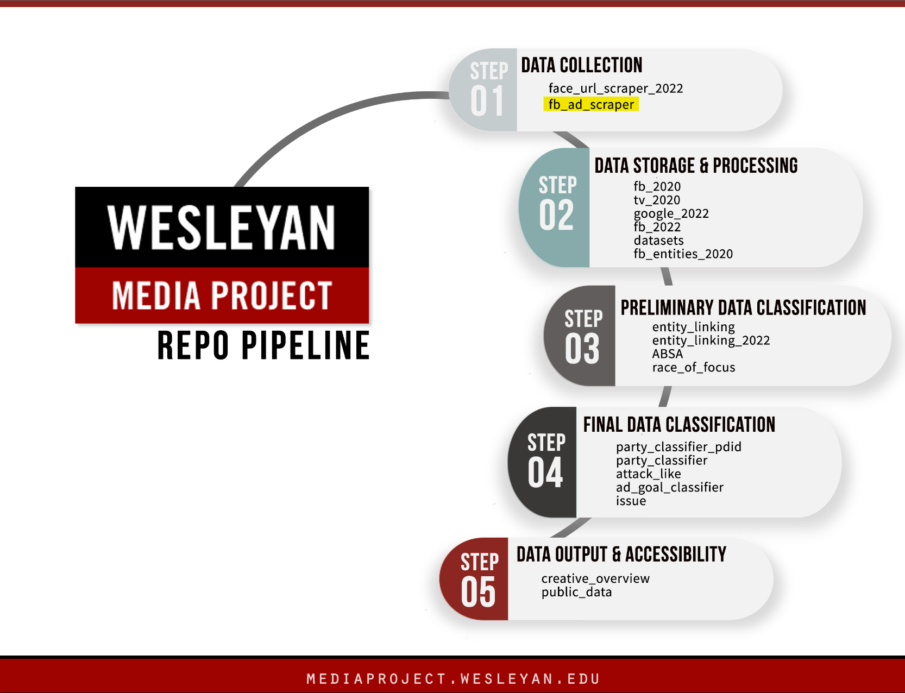

# Wesleyan Media Project - fb_ad_scraper

Welcome! This repo is a part of the Cross-platform Election Advertising Transparency initiatIVE ([CREATIVE](https://www.creativewmp.com/)) project. CREATIVE is a joint infrastructure project of WMP and privacy-tech-lab at Wesleyan University. CREATIVE provides cross-platform integration and standardization of political ads collected from Google and Facebook.


This repo is a part of the Data Collection step. You will also need the repo [fb_ads_import](https://github.com/Wesleyan-Media-Project/fb_ads_import) to run the codes.



## Table of Contents


- [Introduction](#introduction)

- [Objective](#objective)

- [Data](#data)
    - [What can you do with this data?](what-can-you-do-with-this-data)

- [Setup](#setup)
    - [SQL Backend](#sql-backend)
    - [Directories to store the files](#directories-to-store-the-files)
    - [The ad queue](#the-ad-queue)
    - [The scraper](#the-scraper)
    - [Facebook Ad Library API](#facebook-ad-library-api)

## Introduction
The purpose of this repository is to provide the scripts that replicate the workflow used by the Wesleyan Media Project to collect the media (images and video) from Facebook ads. 


## Objective


Each of our repos belongs to one or more of the following categories:
- Data Collection
- Data Storage & Processing
- Preliminary Data Classification
- Final Data Classification

This repo is part of the Data Collection section.


## Data
The data generated by this script will be stored in the SQL database with the following tables:
* `ad_queue` - stores the ad id, its page id, and the date when the ad was placed into the queue. The date is used to prioritize more recent ads over the older ads.
* `fb_ads_media` - stores the information about the media: the filenames of the images or videos downloaded from the ad, the byte size of the file, duration of an audio file extracted from the video, dimensions of an image as "width x height", page_id, ad_id, all urls that were present in the ad, and the checksum of the media file. The checksum, along with the media asset url, help us identify duplicates.
* `fb_scrape_msg` - table to store error messages. If an ad triggered an error, there will be a message written into this table.


### What can you do with this data?

We believe this data could be used as a basis for political ads research. It offers rich insights into the Facebook ads. For instance, the ads can be used for cross-platform analysis that compares the advertising strategies with other platforms such as Google to identify their overlaps or discrepancies.

## Setup

### Facebook Ad Library API
This workflow relies on having an access token from the FB Ad Library API. For a description of steps that you need to undertake to be approved for access to the API, please read the API documentation at this [page](https://www.facebook.com/ads/library/api/?source=nav-header)

If your goal is to download the media from a small batch of Facebook political ads and you do not have the access token, please use the `FBAdLibrarian` R package written by Michael Bossetta and Rasmus Schmoekel [GitHub link](https://github.com/schmokel/FBAdLibrarian)

Note that in either case you will need to have the metadata - the `ad_shortcut_url` field from the ad record, - as a starting point.
### SQL Backend

Please run the SQL statements from the `table_setup.sql` file to create the necessary tables. After you run the statements, you will have three new tables:

* `ad_queue` 
* `fb_ads_media` 
* `fb_scrape_msg` 
### Directories to store the files

When run continuously, the script will generate a lot of files. For this reason, we separate the files on the basis of the media type and also by the month when the files were downloaded. Without this, the number of files can become so large that it will substantially slow down, or even preclude, normal operations on files (e.g. list files, or find a specific file and copy it).

You will need to have the following tree of subdirectories inside the folder where you will be running the script. The `m...` folder will need to match the month and year when you are launching your scripts.
```
AdMedia
└── FB
    ├── audio
    │   ├── m07_2023
    │   └── m08_2023
    ├── image
    │   ├── m07_2023
    │   └── m08_2023
    ├── screenshots
    │   ├── m07_2023
    │   └── m08_2023
    └── video
        ├── m07_2023
        └── m08_2023
```

The `m07_2023` and `m08_2023` are the examples of folders used to separate the ad media by date. For instance, if you were to run the scripts in July 2023, then the script will look for a folder named `m07_2023`. The folder is matched to the date when the script **was running**, not to the ad-related dates (e.g. ad delivery start time, ad creation time).

 
### The ad queue

The scraper relies on a database maintained in a MySQL server. In this repo, the name of this database is `dbase1`. The tables in this database store information about scraped ads and also have the queue for the scraper.

An ad is placed into a queue if it has not been scraped before. The ads come from the table `race2022` that is populated by the scripts `race2022.R` and `backpull2022.R` that are described in the `fb_ads_import` [repository](https://github.com/Wesleyan-Media-Project/fb_ads_import).

The queue is populated by running the `insert_ad_ids_into_queue.R` script. You would run the script from the command line using the following code:

```{bash}
nohup R CMD BATCH --no-save --no-restore insert_ad_ids_into_queue.R  ./Logs/insert_ad_ids_$(date +%Y-%m-%d).txt &
```

### The scraper
The scraper is a Python script that uses Google Chrome in headless mode together with Selenium.

As a first step, the script downloads a list of ad ids to scrape. The ids come from the `ad_queue` table in the `dbase1` database.

The script will accept one command-line argument: `offset`. This argument controls the `offset` parameter in the query to the server. The query will retrieve 20,000 ad ids and normally the offset parameter is set to 20,000. This parameter was introduced to enable scraping by several scripts in parallel. Each script is launched in a bash file, and the difference is the offset value.

We have discovered that the Ad Renderer server has a limit on the number of page visits, and if we launched three scraper threads, the limit would be exceeded. Thus, we launch at most two threads.

The ads are accessed through their URLs provided by the FB API. A special feature, not available to the public, is that if we add the access token to the URL, we are shown a page that contains only one ad, and no other information. This is a different behavior from the public access - entering an ad URL leads to a redirect to the page that shows several ads from the same page.

The access token is stored in a separate file on the server, so that there is one central copy of the token. The token is generated through the Meta's Graph API Explorer console https://developers.facebook.com/tools/explorer. The token is valid for 60 days and has to be manually renewed.
